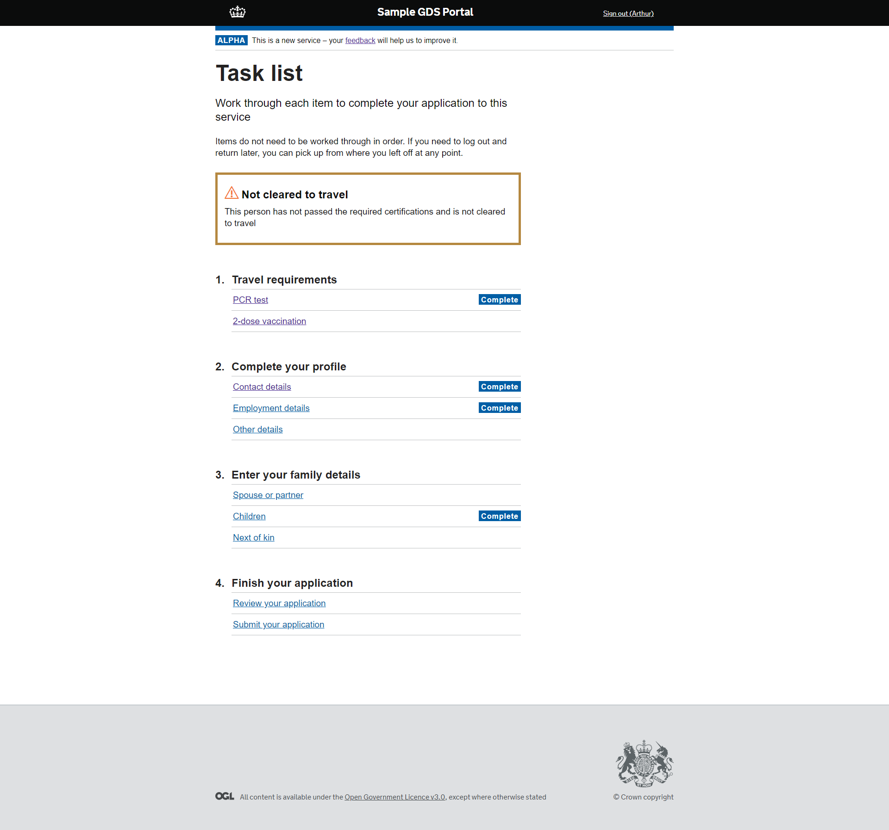

# Power Portal GDS Accelerator 

Base framework for a Dynamics 365/PowerApps Portal using GDS styling and patterns

Importing the sample solution and all data gives you a fully functional portal with example pages for further extension

The portal configuration can be imported using the [Power Apps Cli](https://docs.microsoft.com/en-us/powerapps/developer/data-platform/powerapps-cli#standalone-power-platform-cli)

Look here for installation details: **[Installation](documentation/installation.md)**

## Configuration Entities

[Web Templates](documentation/configuration-entities/web-templates.md)

[Page Templates](documentation/configuration-entities/page-templates.md)

[Web Files](documentation/configuration-entities/web-files.md)

[Site Settings](documentation/configuration-entities/site-settings.md)

[Content Snippets]()

[Web Pages](documentation/configuration-entities/web-pages.md)

[Web Link Sets](documentation/configuration-entities/web-link-sets.md)

[Entity Forms](documentation/configuration-entities/entity-forms.md)

[Entity Lists](documentation/configuration-entities/entity-lists.md)

## Sample solution and data (TODO)

To enable a fully functional portal with sufficient data to allow for sample entity forms and lists, this repo also includes a basic solution with a single entity and sample data to populate it.

Details can be found here:

[Sample Solution](documentation/sample-solution.md)

[Sample Entity Data](documentation/sample-data-entities/sample-entity.md)

## Best practices on GDS Power Portals

- [Avoid Web Forms like the plague](https://cloudawesome.uk/2021/06/16/portal-avoid-advanced-forms-like-the-plague/)
- Structure and hierarchy of URLs/site map
- Keep contents of a page to a single subject, minimising scrolling
- Always include a lead paragraph
- Prefer a "what you need" page before each section
- Get over your great of having too many pages - it's better than fewer long pages with lots of text and/or data entry
- Include "Check your answers" pages even if it's one page if it keeps the whole section consistent
- Test your UX regularly and often with end users

## Feedback and Suggestions

I'm always happy to receive feedback, bug reports or any pull requests submitted.

Hope this repo helps someone get up and running faster and if there's something manual that is taking more time to get up and running, let me know!

