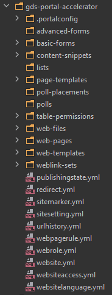
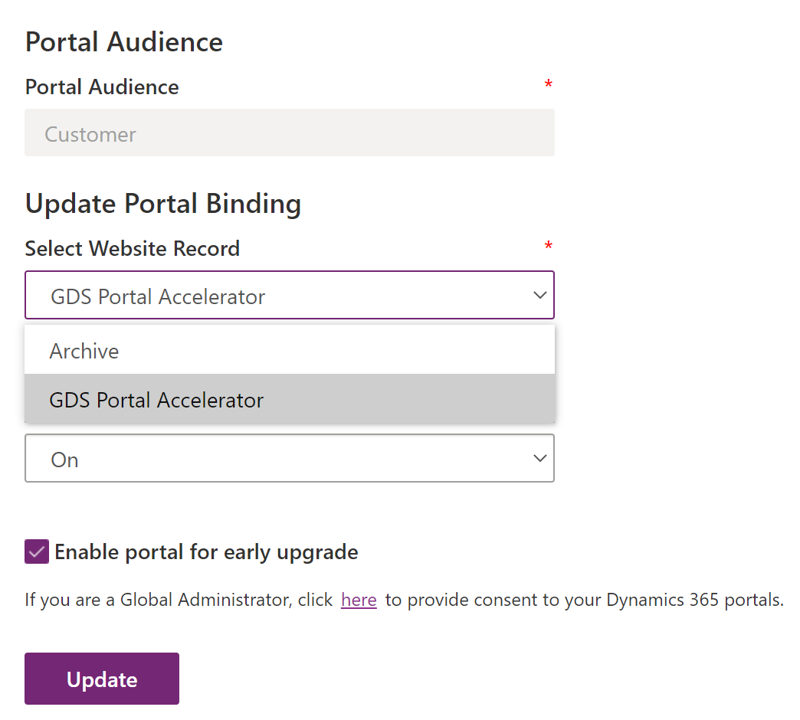

# Installation

The [portal configuration source code](/src/gds-portal-accelerator) has been extracted using the [Power Apps Cli](https://docs.microsoft.com/en-us/powerapps/developer/data-platform/powerapps-cli#standalone-power-platform-cli) (version 1.9.4)



Download the CLI (or the VS Code extension) before continuing.

Once installed, simply: 

1. authenticate to your environment:

```powershell
pac auth create `
    --name NameYourEnvironmentForFutureUse `
    --url YourTargetCrmEnvironmentUrl
    #--applicationId YouAppRegistrationId `
    #--clientSecret YourAppRegistrationSecret `
    #--tenant YourAppRegistrationAdTenantId `

pac auth list
```

2. Upload the site configuration:

```powershell
pac paportal upload `
    --path 'Path/To/The/Source/Code/gds-portal-accelerator'
```

The source in this repo works out of the box if the portal you have installed is using the Customer template. 

If you have any other template installed (e.g. Partner portal, Employee self-service) then the upload will create a new set of records instead of updating the existing records. This is absolutely fine (in some respects could be better), but means you will have to update the target portal binding in the Power Apps portal admin center



For more info on authentication and other commands in the pac cli see here: [Power Apps Cli](https://docs.microsoft.com/en-us/powerapps/developer/data-platform/powerapps-cli)